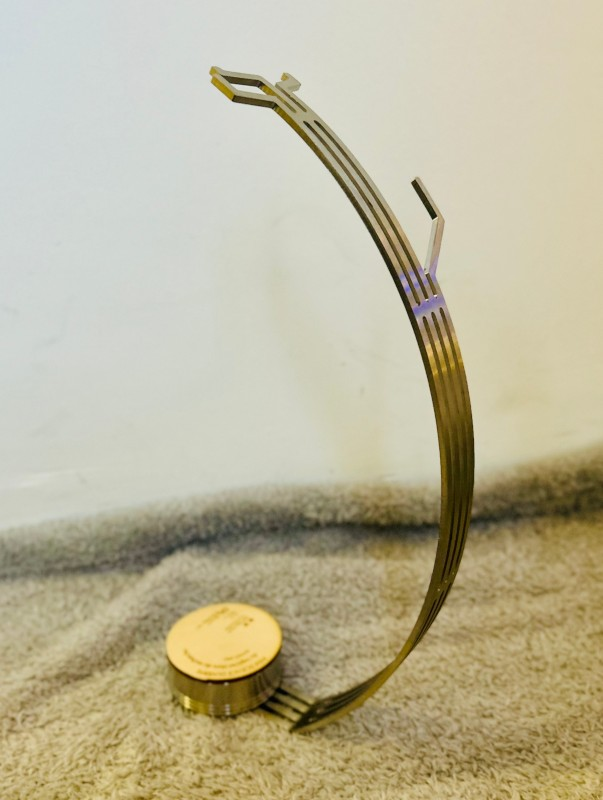

.. post:: 2025-12-01
   :tags: award, open science, upcoming
   :category: event

HyperSpy receives Open Science Award for Open Source Research Software
======================================================================

We are proud that **HyperSpy** has been 
awarded the `Open Science Award for Open Source Research Software 
<https://www.ouvrirlascience.fr/category/open-source-software-prices/>`_ for 
2025 in the category "**Jury's Favourite**" *(Coup de cœur du jury)*. It was the fourth edition of
this award sponsored by the French Ministry of Research (`Announcement of the winners in French
<https://www.ouvrirlascience.fr/remise-des-prix-science-ouverte-du-logiciel-libre-de-recherche-edition-2025>`_).
The award was presented to representatives of the development team on December 1 in Paris 
during the French annual conference on scientific data (`ANDOR 2025 
<https://andor2025.sciencesconf.org/>`_). The prize honours the continuous efforts
of the HyperSpy community to deliver a reliable, well documented and powerful
tool for multidimensional data analysis:

*"HyperSpy is a free library for Python, licensed under GPLv3, which helps materials 
science researchers analyze and visualize complex data, such as multidimensional
datasets. Developed over more than 18 years, it is now a benchmark tool in this
field. It facilitates the exploration, interpretation, and sharing of this type
of data. HyperSpy's impact extends beyond academia to industry. In addition, its
documentation is comprehensive and complies with accessibility standards. There
is also significant support offered to the user community: training, hackathons,
schools, and direct communication from the team."*

This achievement would not have been possible without all the contributors who have helped
grow HyperSpy and its ecosystem over the years. Whether you wrote code, reported issues, reviewed
pull requests, participated in discussions, taught in tutorial sessions, or helped in any other way:
**this award is yours!**

|

**Further information:**

* `Announcement in HyperSpy's GitHub Repository
  <https://github.com/hyperspy/hyperspy/issues/3572>`_ acknowledging all contributors active on GitHub
* Official page on `Ouvrier la Science
  <https://www.ouvrirlascience.fr/category/open-source-software-prices/>`_
* The idea and rationale behind the award are described in an article on the
  platform `Open Science Europe 
  <https://open-research-europe.ec.europa.eu/articles/3-185/v1>`_
* `Wikipedia Article <https://en.wikipedia.org/wiki/Open_Science_Award_for_Open_Source_Research_Software>`_ on the Open Science Award for Open Source Research Software 
  

|

|

.. image:: https://www.ouvrirlascience.fr/wp-content/uploads/2025/12/Hyperspy.png 
    :alt:  OpenScience banner for HyperSpy award 2025
    :height: 250
    :target: https://www.ouvrirlascience.fr/remise-des-prix-science-ouverte-du-logiciel-libre-de-recherche-edition-2025/

.. image:: images/OpenScience.png
    :alt:  OpenScience logo
    :height: 250
    :target: https://www.ouvrirlascience.fr/category/open-source-software-prices/

