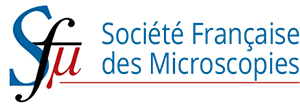

.. post:: 2023-03-01
   :tags: training, SFµ, lumiSpy, pyxem
   :category: event

HyperSpy Training Workshop @ 18e colloque SFµ, July 3-4, 2023
=============================================================

A pre-conference training workshop on HyperSpy will be held at the 18e Colloque
de la Société Française des Microscopies (SFµ) in Rouen on July 3-4 2023. The workshop
will feature an introductory talk and hands-on tutorials on HyperSpy, EELS analysis,
EDX analysis, Diffraction and LumiSpy.

Attendance is limited as a computer room of the university will be used.

